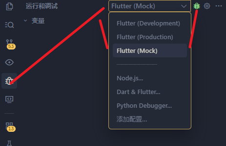
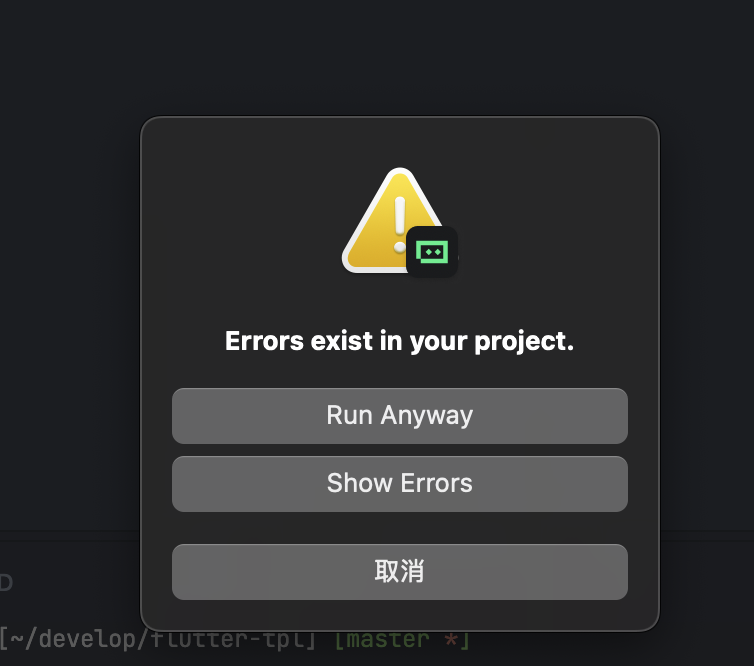
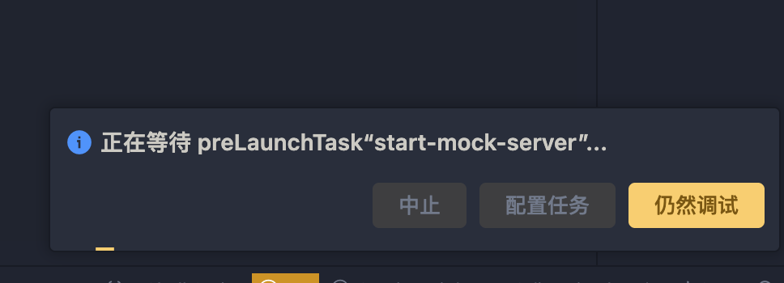
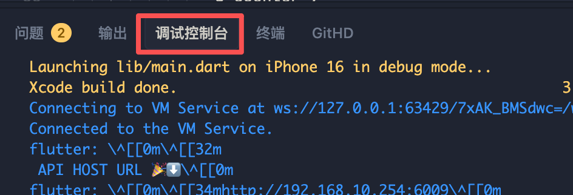

# ybx_parent_client

优伴学家长端app

## cc mcp安装

[mcp](mcp.md)

## 如何运行多环境

### 推荐通过debug方式运行（自动刷新）

见下图：

选择运行环境，点击调试按钮运行, 改代码会自动刷新



然后点击 run-anyway



- debug时，点击继续调试



debug模式的日志，点击下面的标签页查看



### 手动运行，需要按 r进行刷新

首先项目根目录执行: `pnpm i`

- run mock

```bash
npm run dev:mock
```

会自动创建.env.mock.local 文件，内容如下

```md
# ====== mock，填写你本机的ip 地址 + 6009 ====
API_HOST = http://192.168.10.254:6009
ENV_NAME = mock
```

- run dev

```bash
npm run dev
```

- run prod

```bash
npm run dev:prod
```


## 构建

```bash
npm run build:apk

npm run build:ios
```
